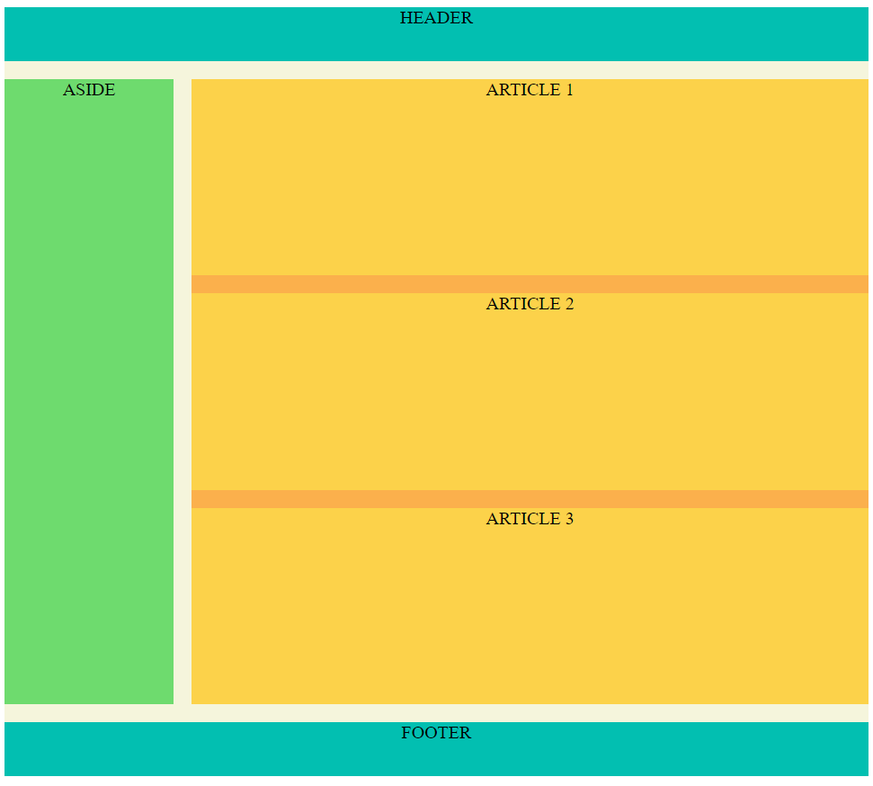
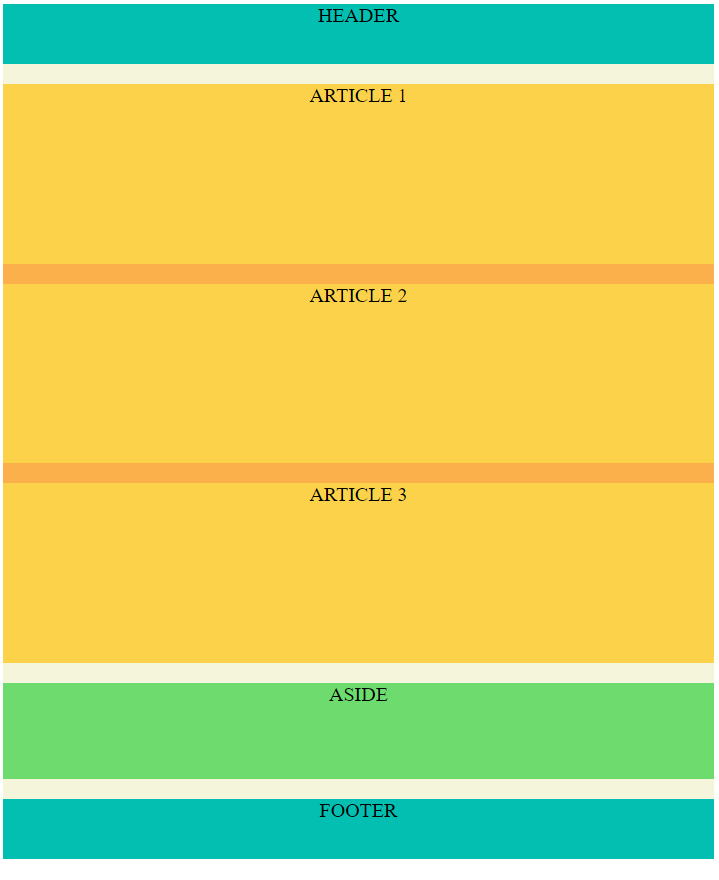
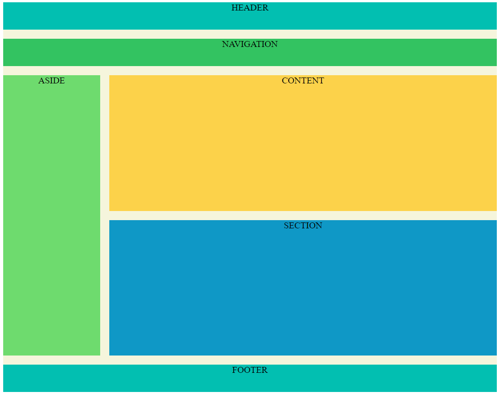
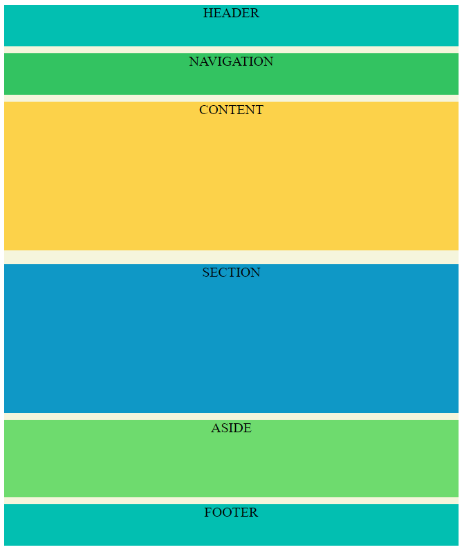
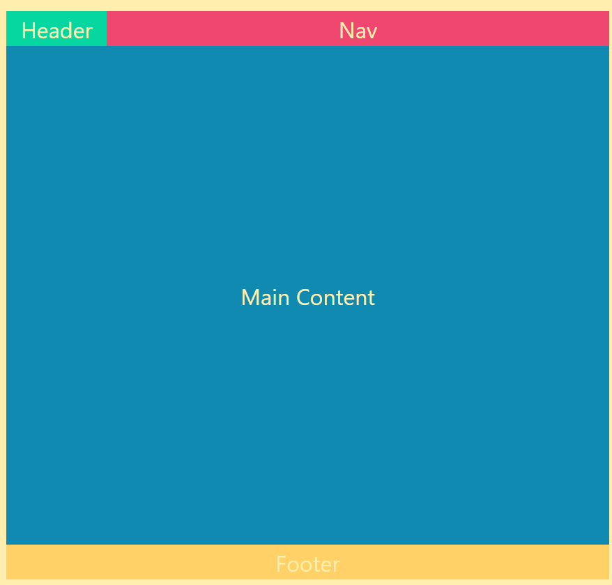
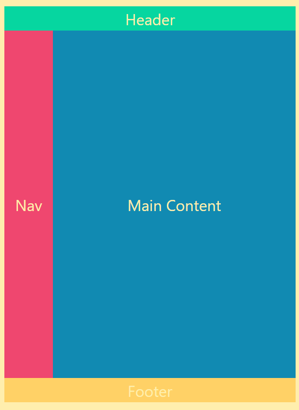

# CSS GRID Practice

## What i learned?

### GRID container properties

---

> grid-template-columns: [none - default | minmax(min, max) | maxcontent | mincontent]

-   `grid-template-columns: 1fr 1fr`
-   `grid-template-columns: minmax(50px, 1fr) 3fr`
-   `grid-template-columns: repeat(5, 1fr)`
-   `grid-template-columns: 50px auto 100px 1fr`

> grid-template-rows: [none - default | minmax(min, max) | maxcontent | mincontent]

-   `grid-template-rows: [100px 1fr];`
-   `grid-template-rows: [80px 200px;];`

> grid-template-areas: [grid-area-name | . | none]

-   `grid-template-areas: "header header header header" "main main . sidebar" "footer footer footer footer"`

> column-gap: [line size]

-   `column-gap: 20px;`

> row-gap: [line size]

-   `row-gap: 20px;`

> grid-gap: [row-gap column-gap]

-   `grid-gap: 10px 20px;`
-   `grid-gap: 20px;`

-   **Alignment item**

> justify-items: start | end | center | stretch;

-   `justify-items: stretch;` > - align-items: start | end | center | stretch;
-   ` align-items: center;`

-   **Alignment whole grid**

> justify-content: start | end | center | stretch | space-around | space-between | space-evenly;

-   `justify-content: space-around;`

> align-content: start | end | center | stretch | space-around | space-between | space-evenly;

-   `align-content: space-between;`

> grid-auto-columns: [track-size]

-   `grid-auto-columns: 80px;`

> grid-auto-rows: [track-size]

-   `grid-auto-rows: 150px;`

> grid-auto-flow: [row - default | column | dense | row-dense | column-dense ]

-   ` grid-auto-flow: dense;`

### Grid item properties

---

> grid-column-start: [number | span number | auto]

-   `grid-column-start: 1;`

> grid-column-end: [number | span number | auto]

-   `grid-column-end: -1;`

> grid-row-start: [number | span number | auto]

-   `grid-column-end: 2;`

> grid-row-end: [number | span number | auto]

-   `grid-column-end: 5;`

> grid-column: [grid-column-start / grid-column-end ]

-   `grid-column: 1 / span 2;`

> grid-row: [grid-row-start / grid-row-end]

-   `grid-row: 2 / 4;`

> grid-area: [name | row-start / column-start / row-end / column-end]

-   `grid-area: header;`
-   `grid-area: 2 / 1 / 4 / span 2;`

> justify-self: start | end | center | stretch;

-   `justify-self: start;`

> align-self: start | end | center | stretch;

-   `align-self: center;`

## Simple Project Screenshot

---

_Note:_ To see the project code check the different branch

**Responsive website layout one**

-   Desktop mode 
-   Mobile mode 

**Responsive website layout one**

-   Desktop mode 
-   Mobile mode 

**Responsive website layout three**

-   Desktop mode 
-   Mobile mode 

## 🚀 About Me

I'm a front-end developer with backend knowledge.

## 🛠 Skills

**Front-end** : Javascript, React, Next.js, HTML, CSS, Bootstrap, Tailwind, SASS, SVG, GSAP

**Aditional Backend** : Node.js, Express.js, MongoDB, MySQL
